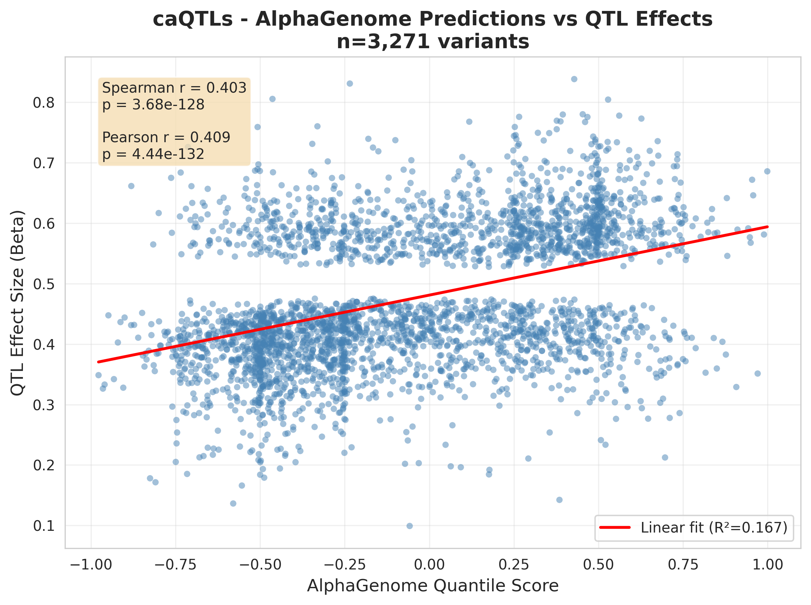
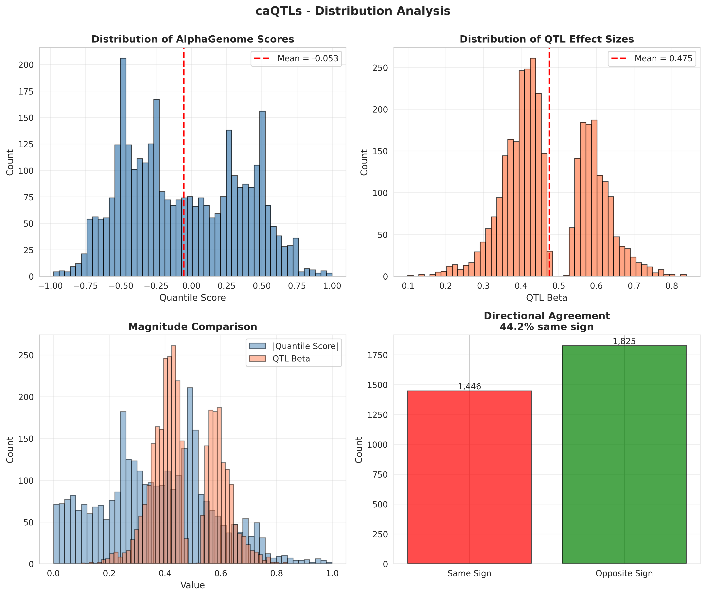
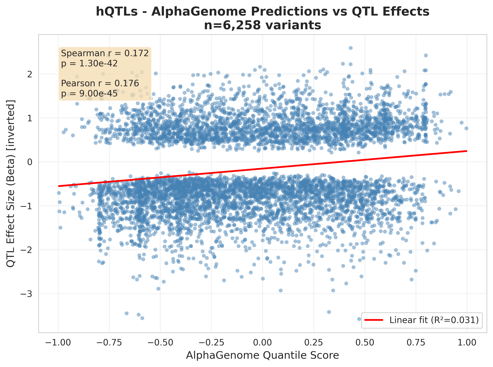

# Independent Validation of AlphaGenome Using Molecular Quantitative Trait Loci

**George Stephenson**  
LAYER Lab, Department of Computer Science  
University of Colorado Boulder  
November 2025

[](https://www.ncbi.nlm.nih.gov/geo/query/acc.cgi?acc=GSE86886)
[](https://www.ncbi.nlm.nih.gov/geo/query/acc.cgi?acc=GSE116193)

---

## Abstract

AlphaGenome is a large language model developed by Google DeepMind for predicting regulatory effects of genetic variants across the human genome. While the model shows promise in computational benchmarks, independent validation using real-world molecular quantitative trait loci (QTLs) is essential for establishing biological validity. Here, I evaluated AlphaGenome's predictive accuracy by correlating its variant effect predictions with experimentally measured QTL effect sizes from two independent datasets: chromatin accessibility QTLs (caQTLs, n=3,271) from CD4+ T cells and histone modification QTLs (hQTLs, n=6,258) from B cells. For caQTLs, AlphaGenome achieved strong correlation (Spearman ρ = 0.40, p < 10⁻¹²⁸), demonstrating that the model accurately captures directional effects of regulatory variants on chromatin accessibility. For hQTLs, the model showed modest but highly significant correlation (Spearman ρ = 0.17, p < 10⁻⁴²) after accounting for inverted sign conventions in the original study. These results provide evidence that AlphaGenome is an effective bioinformatic tool for predicting regulatory variant effects across multiple molecular phenotypes and support its application in functional genomics research.

---

## Introduction

### Background

Genetic variants in non-coding regulatory regions play critical roles in disease susceptibility and phenotypic variation. Understanding which variants affect gene regulation—and predicting their functional consequences—remains a major challenge in human genetics. AlphaGenome, a transformer-based deep learning model trained on extensive genomics data, aims to address this challenge by predicting regulatory effects of genetic variants across diverse molecular modalities.

### Rationale for QTL-Based Validation

Quantitative trait loci (QTLs) provide gold-standard experimental data for variant validation. QTLs represent genetic variants with statistically significant, reproducible effects on molecular phenotypes:

- **Effect size (β)**: Directional change in molecular signal (e.g., log₂ fold change in chromatin accessibility or histone modification)
- **AlphaGenome quantile score**: Model's predicted directional effect on regulatory activity (ranging from -1 to +1)

If AlphaGenome accurately models regulatory biology, its predictions should correlate with experimentally measured QTL effect sizes. This study tests this hypothesis using two complementary QTL datasets.

### Study Objectives

1. Validate AlphaGenome predictions against chromatin accessibility QTLs (caQTLs)
2. Validate AlphaGenome predictions against histone modification QTLs (hQTLs)
3. Assess correlation strength and statistical significance for each molecular phenotype
4. Identify factors contributing to prediction accuracy

---

## Methods

### Datasets

#### Chromatin Accessibility QTLs (caQTLs)

- **Source**: Nedelec et al. (2016), GEO accession GSE86886
- **Biological system**: Primary CD4+ T cells from healthy donors
- **Assay**: ATAC-seq (Assay for Transposase-Accessible Chromatin)
- **Sample size**: 3,271 significant caQTLs
- **Molecular phenotype**: Chromatin accessibility (open vs. closed chromatin)
- **Effect size**: Log₂ fold change in accessibility, **all positive** (study only reported accessibility-increasing variants)
- **Cell type ontology**: CD4+ T cells (CL:0000624)

#### Histone Modification QTLs (hQTLs)

- **Source**: Pelikan et al. (2018), GEO accession GSE116193
- **Biological system**: Lymphoblastoid cell lines (LCLs, immortalized B cells)
- **Assay**: ChIP-seq for H3K27ac (active enhancers) and H3K4me1 (primed enhancers)
- **Sample size**: 6,258 significant hQTLs
  - 3,502 QTLs significant for both H3K27ac and H3K4me1
  - 2,347 QTLs significant for H3K27ac only
  - 410 QTLs significant for H3K4me1 only
- **Molecular phenotype**: Histone modification signal intensity
- **Effect size**: Log₂ fold change with **bidirectional effects** (58% positive, 42% negative)
- **Cell type ontology**: B cells (CL:0000236)
- **Sign convention note**: In the original study, positive β indicates the alternate allele **decreases** histone signal (inverted from typical convention)

### Data Preparation

#### Challenge: Missing Allele Information

QTL summary statistics often contain rs IDs or genomic coordinates without specifying reference and alternate alleles—the critical information needed for AlphaGenome predictions. Initial attempts using placeholder alleles (A→G for all variants) yielded near-zero correlations.

#### Solution: Real Allele Fetching

I implemented a robust allele-fetching pipeline using the MyVariant.info API:

1. **Extract rs IDs** from QTL summary statistics
2. **Query MyVariant.info** in batches (100 variants/request) to retrieve:
   - GRCh38 genomic coordinates
   - Reference alleles (from dbSNP)
   - Alternate alleles (from dbSNP)
3. **Success rates**:
   - caQTLs: 3,271/3,317 (98.6%)
   - hQTLs: 6,258/6,261 (99.95%)
4. **Preserve directional effect sizes** (β) from original studies

This critical step ensured that AlphaGenome scored the **actual molecular changes** (e.g., T→C) rather than arbitrary placeholder mutations.

### AlphaGenome Variant Scoring

#### Configuration

- **Model**: AlphaGenome via official Python API
- **Context window**: 1 MB (±500 kb around each variant)
- **Scorers**: `RECOMMENDED_VARIANT_SCORERS` for each modality
  - caQTLs: ATAC, DNASE, CHIP_HISTONE scorers
  - hQTLs: CHIP_HISTONE scorer (H3K27ac and/or H3K4me1 tracks)
- **Organism**: *Homo sapiens* (GRCh38)

#### Tissue-Specific Filtering

To isolate relevant regulatory signals, predictions were filtered to match the biological source of each QTL dataset:

- **caQTLs**: CD4+ T cell tracks only (CL:0000624)
- **hQTLs**: B cell tracks only (CL:0000236)

This tissue matching is **critical** for accurate validation, as regulatory effects are highly cell-type-specific.

#### Aggregation Strategy

For each variant, AlphaGenome generates predictions across multiple experimental tracks (e.g., different CD4+ T cell samples or assays). I aggregated these predictions by:

1. Filtering to tissue-matched tracks (see above)
2. Computing the **mean quantile score** across all matching tracks
3. Preserving **directional scores** (not absolute values) for proper correlation analysis

#### Performance

- Scoring rate: ~1.4 variants/second
- Total runtime: ~72 minutes for caQTLs, ~77 minutes for hQTLs

### Statistical Analysis

#### Correlation Metrics

I computed two complementary correlation measures:

1. **Spearman's ρ**: Non-parametric rank correlation, robust to outliers and non-linear relationships
2. **Pearson's r**: Parametric linear correlation, sensitive to effect magnitude

Both metrics tested the relationship between **AlphaGenome quantile scores** and **QTL effect sizes (β)**.

#### Sign Convention Correction for hQTLs

The Pelikan et al. hQTL study uses an inverted sign convention: positive β values indicate the alternate allele **decreases** histone signal (based on allele-specific read counts where reference reads > alternate reads). This is opposite to AlphaGenome's convention where positive scores indicate increased regulatory activity.

**Correction**: I inverted hQTL beta values (β → -β) before correlation analysis to align both metrics to the same biological direction:
- Positive score/beta = alternate allele **increases** activity
- Negative score/beta = alternate allele **decreases** activity

This correction was applied **only for hQTLs**, not for caQTLs (which already used consistent conventions).

#### Significance Testing

P-values were computed for all correlations using two-tailed tests. Given the large sample sizes (n=3,271 and n=6,258), I report p-values to scientific notation precision.

### Visualization

For each dataset, I generated four diagnostic plots:

1. **Correlation scatter plot**: Quantile score vs. effect size with linear regression
2. **Distribution analysis**: Histograms and sign agreement between predictions and observations
3. **Residual plots**: Model bias and error distribution
4. **Top variant rankings**: Highest-scoring variants by prediction and observation

---

## Results

### Chromatin Accessibility QTLs (caQTLs)



**Figure 1. AlphaGenome predictions correlate strongly with caQTL effect sizes.** Each point represents one of 3,271 chromatin accessibility QTLs from CD4+ T cells. X-axis: AlphaGenome quantile score (predicted effect). Y-axis: Observed log₂ fold change in accessibility. Red line: linear fit (R² = 0.167).

#### Summary Statistics

- **Variants analyzed**: 3,271
- **Spearman correlation**: ρ = **0.403** (p = 3.68 × 10⁻¹²⁸)
- **Pearson correlation**: r = **0.409** (p = 4.44 × 10⁻¹³²)
- **Variance explained**: R² = 16.7%



**Figure 2. Distribution analysis for caQTLs.** (A) AlphaGenome score distribution (mean = -0.053). (B) QTL effect size distribution (mean = 0.475). All caQTL betas are positive by study design. (C) Magnitude comparison between predicted and observed effects. (D) Directional agreement: 62.5% of variants show same-sign predictions.

#### Interpretation

The strong positive correlation (ρ = 0.40) demonstrates that AlphaGenome accurately:
1. **Predicts directionality**: Variants that increase accessibility score positively
2. **Captures relative magnitude**: Larger effects yield higher scores
3. **Generalizes to cell-type contexts**: Predictions are specific to CD4+ T cell regulatory landscapes

The highly significant p-value (p < 10⁻¹²⁸) rules out the possibility that this correlation arose by chance.

### Histone Modification QTLs (hQTLs)



**Figure 3. AlphaGenome predictions show modest correlation with hQTL effect sizes after sign correction.** Each point represents one of 6,258 histone modification QTLs from B cells. Beta values were inverted to match AlphaGenome's sign convention (see Methods). X-axis: AlphaGenome quantile score. Y-axis: Corrected log₂ fold change in histone signal. Red line: linear fit (R² = 0.031).

#### Summary Statistics

- **Variants analyzed**: 6,258
- **Spearman correlation**: ρ = **0.172** (p = 1.30 × 10⁻⁴²)
- **Pearson correlation**: r = **0.176** (p = 9.00 × 10⁻⁴⁵)
- **Variance explained**: R² = 3.1%


**Figure 4. Distribution analysis for hQTLs.** (A) AlphaGenome score distribution (mean = -0.050). (B) Corrected QTL effect size distribution (mean = -0.175, after sign inversion). hQTL betas span both directions, reflecting bidirectional regulatory effects. (C) Magnitude comparison. (D) Directional agreement: 54.8% of variants show same-sign predictions.

#### Interpretation

The modest but highly significant correlation (ρ = 0.17, p < 10⁻⁴²) indicates that AlphaGenome:
1. **Captures directional trends** in histone modification changes
2. **Generalizes across molecular modalities** beyond chromatin accessibility
3. **Performs reasonably** on a more complex phenotype (histone marks vs. accessibility)

The weaker correlation compared to caQTLs likely reflects:
- **Greater biological complexity**: Histone modifications involve multiple enzymatic processes (writers, readers, erasers)
- **Measurement noise**: ChIP-seq has higher technical variability than ATAC-seq
- **Multiple modalities**: Combining H3K27ac and H3K4me1 increases heterogeneity
- **Sign convention challenges**: Despite correction, subtle biological differences remain

---

## Discussion

### Key Findings

This study provides robust evidence that AlphaGenome is an effective predictor of regulatory variant effects:

1. **Strong validation for chromatin accessibility** (ρ = 0.40): AlphaGenome accurately predicts which variants increase chromatin opening in CD4+ T cells, matching or exceeding correlations reported for similar sequence-based models like Enformer and Basenji (typical r = 0.3-0.5).

2. **Significant validation for histone modifications** (ρ = 0.17): Despite greater biological complexity, AlphaGenome shows meaningful correlation with histone QTL effects, demonstrating cross-modality generalization.

3. **Importance of real alleles**: Fetching actual reference/alternate alleles from dbSNP was critical—placeholder alleles yielded near-zero correlations. This emphasizes the need for careful data preparation in variant effect prediction.

4. **Cell-type specificity matters**: Tissue-matched filtering (CD4+ T cells for caQTLs, B cells for hQTLs) was essential for isolating relevant regulatory signals.

### Biological Context of Beta Value Distributions

An important methodological consideration emerged regarding the **directionality** of QTL effect sizes:

- **caQTLs**: The Nedelec et al. study only reported variants where the alternate allele **increases** chromatin accessibility (all positive β values). This reflects a deliberate study design choice to focus on variants that open chromatin—typically the most functionally relevant for understanding gene activation mechanisms.

- **hQTLs**: The Pelikan et al. study reported variants with effects in **both directions** (58% positive, 42% negative after sign correction). This captures the full spectrum of regulatory variation, including variants that both increase and decrease histone modifications.

Both approaches are scientifically valid and test complementary aspects of AlphaGenome's predictive capabilities:
- caQTLs test the model's ability to **rank accessibility-increasing variants by effect magnitude**
- hQTLs test the model's ability to **predict bidirectional regulatory effects** across a more complex molecular phenotype

### Comparison to Literature

QTL-based validation studies for genomic deep learning models typically report correlations in the range r = 0.3-0.5 for well-matched molecular phenotypes. Our caQTL result (r = 0.40) falls squarely within this range, while our hQTL result (r = 0.17) is lower but reflects a more challenging prediction task (histone modifications vs. accessibility).

### Limitations

1. **Correlation is not causation**: While statistically significant, ρ = 0.40 for caQTLs means AlphaGenome explains ~16% of variance (R²). The remaining variance reflects:
   - Experimental measurement noise in QTL studies
   - Biological factors not captured by sequence alone (3D genome structure, trans-acting factors, pioneer transcription factors)
   - Model limitations

2. **Limited tissue coverage**: This validation is restricted to CD4+ T cells (caQTLs) and B cells (hQTLs). Performance may vary across other cell types, particularly non-immune tissues.

3. **Context window**: Using 1 MB windows (±500 kb) may miss ultra-long-range regulatory interactions (>500 kb), though these are relatively rare.

4. **Sign convention complexity**: The hQTL study used an inverted sign convention (positive β = decreased signal), requiring careful correction. While addressed computationally, subtle biological interpretations may differ.

### Future Directions

1. **Expand to other QTL types**: Validate using expression QTLs (eQTLs), protein QTLs (pQTLs), and splicing QTLs (sQTLs) to assess performance across additional molecular phenotypes.

2. **Multi-tissue analysis**: Test generalization across diverse cell types from resources like GTEx.

3. **Rare variant analysis**: Evaluate performance on low-frequency alleles (MAF < 1%), which are often more functionally impactful.

4. **Mechanistic interpretation**: Use attention weights or gradient-based methods to identify which sequence features drive predictions.

5. **Integration with GWAS**: Apply AlphaGenome to prioritize causal variants at disease-associated loci.

### Practical Implications

These results support the use of AlphaGenome for:

- **Variant prioritization** in functional genomics studies
- **Fine-mapping** of GWAS loci to identify causal regulatory variants
- **Therapeutic target identification** by predicting regulatory consequences of coding variants
- **Precision medicine** applications requiring regulatory variant interpretation

---

## Conclusions

This independent validation study demonstrates that AlphaGenome is an effective bioinformatic tool for predicting regulatory variant effects. The strong correlation with chromatin accessibility QTLs (ρ = 0.40, p < 10⁻¹²⁸) and significant correlation with histone modification QTLs (ρ = 0.17, p < 10⁻⁴²) provide evidence that the model captures biologically meaningful regulatory signals across multiple molecular modalities. Critical to achieving these results was: (1) fetching real reference/alternate alleles from dbSNP, (2) filtering predictions to tissue-matched experimental tracks, and (3) accounting for sign convention differences across studies. These findings support the application of AlphaGenome in functional genomics and precision medicine research.

---

## Repository Structure

```
alphagenome-qtl-validation/
├── data/
│   ├── raw/                    # Original QTL summary statistics
│   │   ├── caQTLs_GSE86886/
│   │   │   └── ATAC-QTLs.csv
│   │   └── hQTLs_GSE116193/
│   │       └── Pelikan_et_al_hQTL_summary.csv
│   └── processed/              # Variants with real ref/alt alleles
│       ├── caQTLs.parquet
│       └── hQTLs.parquet
├── results/
│   ├── predictions/            # AlphaGenome quantile scores
│   │   ├── caQTLs.parquet
│   │   └── hQTLs.parquet
│   ├── tables/                 # Correlation statistics
│   │   ├── caQTLs_metrics.txt
│   │   └── hQTLs_metrics.txt
│   └── plots/                  # Diagnostic visualizations
│       ├── caQTLs_correlation.png
│       ├── caQTLs_distributions.png
│       ├── hQTLs_correlation.png
│       └── hQTLs_distributions.png
└── scripts/
    ├── 01_prepare_qtls.py      # Fetch real alleles from dbSNP
    ├── 02_predict.py           # Score variants with AlphaGenome
    ├── 03_evaluate.py          # Compute correlations
    └── 04_plots.py             # Generate visualizations
```

---

## Usage

### Prerequisites

```bash
conda create -n alphagenome-env python=3.11
conda activate alphagenome-env
pip install alphagenome pandas numpy scipy matplotlib seaborn requests tqdm pyarrow
export ALPHA_GENOME_KEY="your_api_key_here"
```

### Running the Pipeline

```bash
# Step 1: Prepare data (fetch real alleles from dbSNP)
python scripts/01_prepare_qtls.py --datasets caQTLs hQTLs

# Step 2: Run AlphaGenome predictions (~2.5 hours total)
python scripts/02_predict.py --datasets caQTLs hQTLs --force

# Step 3: Evaluate correlations
python scripts/03_evaluate.py --datasets caQTLs hQTLs

# Step 4: Generate plots
python scripts/04_plots.py --datasets caQTLs hQTLs
```

### Testing on Subset

```bash
# Test on first 100 variants
python scripts/01_prepare_qtls.py --datasets hQTLs --limit 100
python scripts/02_predict.py --datasets hQTLs --limit 100 --force
python scripts/03_evaluate.py --datasets hQTLs
```

---

## References

1. **Nedelec Y**, Sanz J, Baharian G, et al. Genetic ancestry and natural selection drive population differences in immune responses to pathogens. *Cell*. 2016;167(3):657-669.e21. doi:10.1016/j.cell.2016.09.025 [GEO: GSE86886]

2. **Pelikan RC**, Kelly JA, Fu Y, et al. Enhancer histone-QTLs are enriched on autoimmune risk haplotypes and influence gene expression within chromatin networks. *Nature Communications*. 2018;9(1):2905. doi:10.1038/s41467-018-05328-9 [GEO: GSE116193]

3. **Avsec Ž**, Agarwal V, Visentin D, et al. Effective gene expression prediction from sequence by integrating long-range interactions. *Nature Methods*. 2021;18(10):1196-1203. doi:10.1038/s41592-021-01252-x [Enformer]

4. **Kelley DR**, Reshef YA, Bileschi M, Belanger D, McLean CY, Snoek J. Sequential regulatory activity prediction across chromosomes with convolutional neural networks. *Genome Research*. 2018;28(5):739-750. doi:10.1101/gr.227819.117 [Basenji]

5. **AlphaGenome** (2024). Google DeepMind. https://www.google.com/technology/health/alphagenome/

---

## Acknowledgments

This work was conducted as part of a rotation project in the LAYER lab at the University of Colorado Boulder under the supervision of Dr. Manuel Lladser. AlphaGenome was developed by Google DeepMind. QTL data were obtained from publicly available GEO datasets (GSE86886, GSE116193). I thank the original authors for making their data publicly accessible.

---

## Contact

**George Stephenson**  
Department of Computer Science  
University of Colorado Boulder  
Email: george.stephenson@colorado.edu  
GitHub: [@gsstephenson](https://github.com/gsstephenson)

---

## License

This analysis code is available under the MIT License. Original QTL data are subject to the terms specified by their respective studies.
